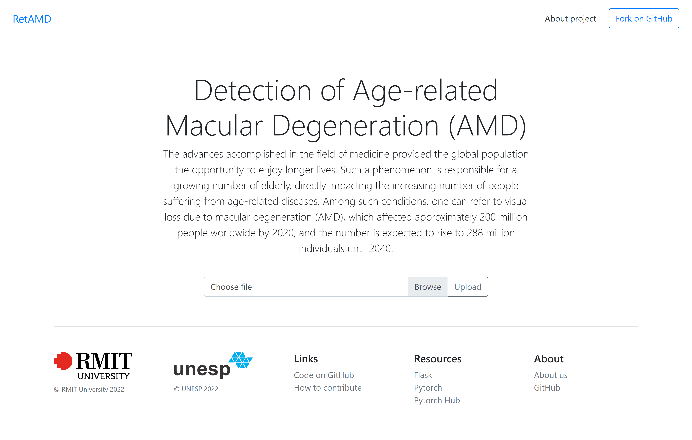
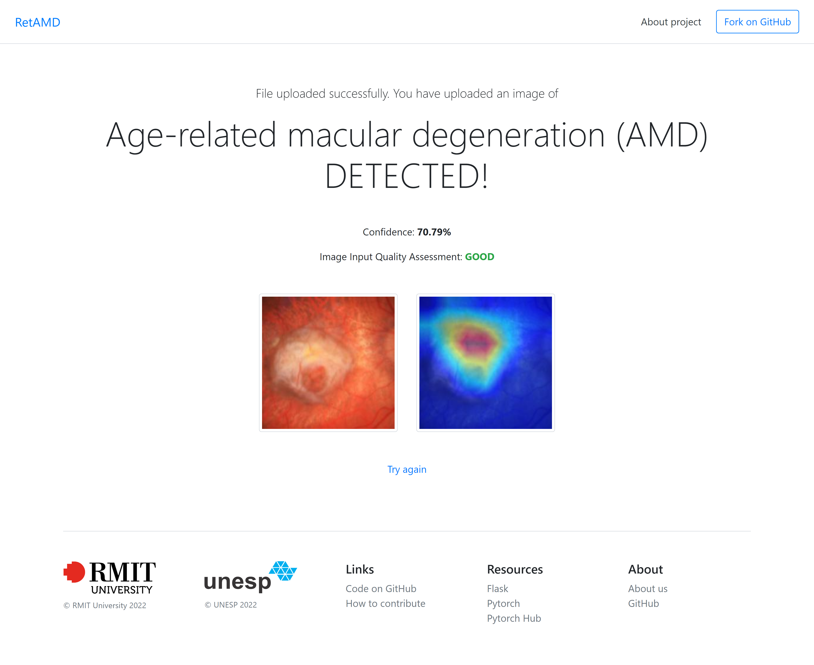

# RetAMD - Retinal Image Classification

RetAMD is a web-based application developed in Flask for classifying retinal images. It specializes in detecting Age-related Macular Degeneration (AMD) using deep learning.


<div align="center">
  
  
</div>


## Features

- **AMD classification**: ResNet-18 architecture pretrained by [Oliveira et al.](https://doi.org/10.1016/j.bspc.2024.106263) This network was trained mixing real and synthetic data generated by StyleGAN-2 to create a robust model that overcomes limitations in generalization.

- **Retinal image quality assessment**: DenseNet trained by [Fu et al.](https://arxiv.org/abs/1907.05345) which classified these in 3 classes: “Good”, “Usable” and “Reject”. The rejected images were of poor quality based on significant blurring, low contrast, inadequate illumination.

- **Decision interpretation**: A heatmap created by GradCAM is displayed on the right. This heatmap highlights the regions that were used in the diagnosis and allows the clinical users to understand the basis of the system's decision.

## Getting Started

These instructions will get you a copy of the project up and running on your local machine for development and testing purposes.

### Prerequisites

Before you begin, ensure you have the following installed:

- [Anaconda](https://www.anaconda.com/distribution/) or [Miniconda](https://docs.conda.io/en/latest/miniconda.html)
- [Git](https://git-scm.com/)

### Installation

1. **Clone the Repository**

   ```bash
   git clone https://github.com/GuiCamargoX/RetAMD.git
   cd retamd

2. **Create and activate the Conda environment:**
   
   ```bash
    conda env create -f environment.yml
    conda activate retamd

### Downloading Model Weights

Before running the application, download the required model weights for DenseNet and ResNet18:

* [DenseNet Weights](https://drive.google.com/file/d/1KwR0JkdyzidSqYXs2PHpKms6tmBjxuB6/view?usp=sharing)

* [ResNet18 Weights](https://drive.google.com/file/d/1W2X9EazWNW___ctrfAZ3z9OdMNx40iUw/view?usp=sharing)

Place these weights in the specified directory (e.g., **weights/**).

### Running the Application

**After setting up the environment and downloading the weights, start the web application:**
    
    python app.py
    

The application will be accessible at http://localhost:5000.

## License

RetAMD is released under the MIT License.


## Reference

If you use this code, please cite the following papers:

1. Oliveira, G. C., Rosa, G. H., Pedronette, D. C., Papa, J. P., Kumar, H., Passos, L. A., & Kumar, D. (2024). Robust deep learning for eye fundus images: Bridging real and synthetic data for enhancing generalization. Biomedical Signal Processing and Control, 94, 106263.

2. Huazhu Fu, Boyang Wang, Jianbing Shen, Shanshan Cui, Yanwu Xu, Jiang Liu, Ling Shao, (2019). Evaluation of Retinal Image Quality Assessment Networks in Different Color-Spaces. In: Shen, D., et al. Medical Image Computing and Computer Assisted Intervention – MICCAI 2019. MICCAI 2019. Lecture Notes in Computer Science(), vol 11764. Springer

## Acknowledgement

We would like to thank Fu et al. for sharing their code at [https://github.com/HzFu/EyeQ](https://github.com/HzFu/EyeQ).
